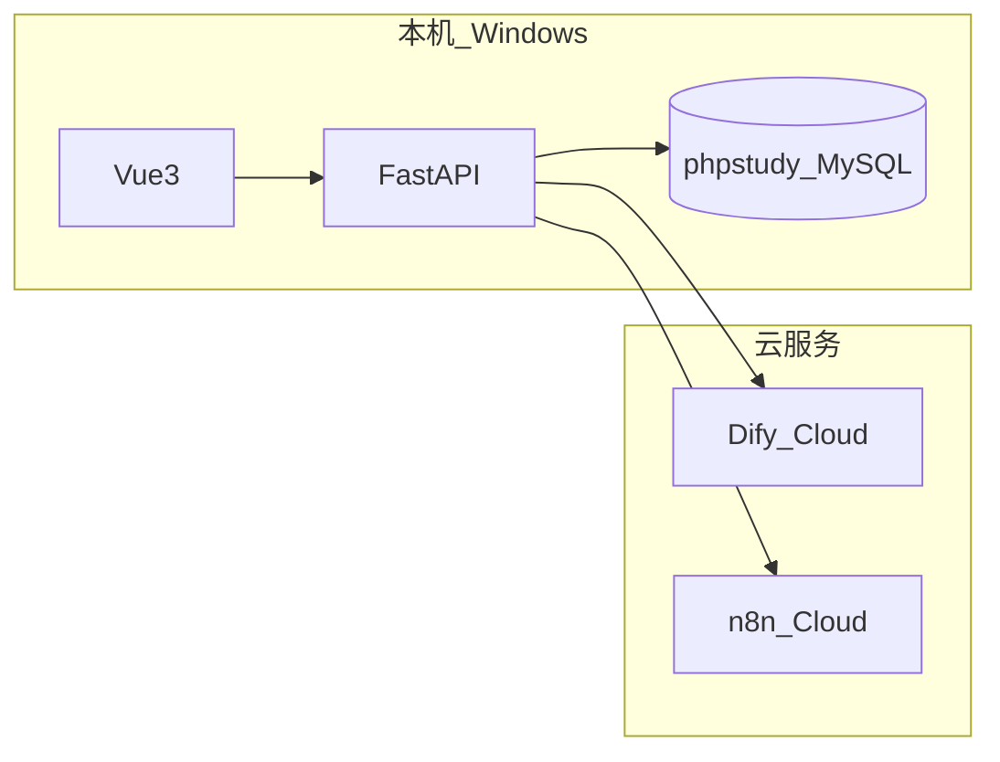

# 方案 A · 无本机 Docker 开发指南

> 适用：Windows 无法安装 Docker Desktop（系统过旧 / MBR 磁盘等）。  
> **本地**：phpstudy MySQL + FastAPI + Vue  
> **云端**：Dify Cloud + n8n Cloud  
> **Docker**：留到 M6 阿里云 ECS（Linux）再学、再部署

---

## 一、架构



---

## 二、Dify Cloud（AI 摘要 + 站内助手）

### 1. 注册

打开 <https://cloud.dify.ai> → 注册 / 登录

### 2. 创建「文章摘要」Workflow

1. **工作室** → **创建应用** → **工作流**
2. 输入变量：`title`（文本）、`content`（段落）
3. LLM 节点生成摘要，结束节点输出：`summary`、`suggested_tags`（可选）
4. **发布** → **API 访问** → 复制 **API Key**

### 3. 创建「站内助手」Chatflow

1. **创建应用** → **聊天助手**
2. 可选：上传知识库（博客 Markdown）
3. 发布 → 复制 **API Key**

### 4. 写入 `backend/.env`

```env
DIFY_API_URL=https://api.dify.ai/v1
DIFY_SUMMARY_API_KEY=app-xxxxxxxx
DIFY_CHAT_API_KEY=app-yyyyyyyy
DIFY_TIMEOUT_SEC=60
```

重启 uvicorn 后访问：

- `GET http://127.0.0.1:8000/api/v1/ai/status`
- 或 `GET http://127.0.0.1:8000/api/v1/integrations/status`

`summary_ready` / `chat_ready` 为 `true` 即成功。

### 5. 前端试用

<http://localhost:5173/myweb/ai>（需平台账号登录）

---

## 三、n8n Cloud（发文 Webhook）

### 1. 注册

<https://n8n.io> → 免费云实例（或 self-host 留到 ECS）

### 2. 创建工作流

1. 新建 Workflow
2. 添加 **Webhook** 节点  
   - Method: POST  
   - Path: `post-published`（示例）  
   - 激活工作流后复制 **Production URL**
3. 添加后续节点（任选其一演示即可）：
   - **Set** — 格式化 JSON  
   - **Send Email** — 发邮件通知  
   - **No Operation** — 仅看执行记录  

### 3. 写入 `backend/.env`

```env
N8N_WEBHOOK_URL=https://你的实例.app.n8n.cloud/webhook/post-published
N8N_WEBHOOK_SECRET=可选自定义密钥
PUBLIC_SITE_URL=http://127.0.0.1:5173/myweb
```

### 4. 验证

Swagger 登录后 `POST /api/v1/posts` 且 `status: published`  
→ n8n 工作流 **Executions** 里应出现一条记录

Webhook 载荷示例：

```json
{
  "event": "post.published",
  "post_id": 1,
  "title": "测试文章",
  "url": "http://127.0.0.1:5173/myweb/content/1",
  "author": "username",
  "published_at": "2026-07-05T12:00:00"
}
```

---

## 四、Redis（可选）

本机无 Docker 时可 **不配置** `REDIS_URL`，API 直连 MySQL。  
有 Docker 或 ECS 后再启用缓存。

---

## 五、完整 `backend/.env` 示例（方案 A）

```env
DATABASE_URL=mysql+pymysql://Cyinc:密码@127.0.0.1:3306/cyinclog
SECRET_KEY=随机长字符串
CORS_ORIGINS=http://localhost:5173,http://127.0.0.1:5173
API_PREFIX=/api/v1

ADMIN_USERNAME=admin
ADMIN_PASSWORD_HASH=bcrypt哈希

DIFY_API_URL=https://api.dify.ai/v1
DIFY_SUMMARY_API_KEY=app-xxx
DIFY_CHAT_API_KEY=app-yyy

N8N_WEBHOOK_URL=https://xxx.app.n8n.cloud/webhook/post-published
PUBLIC_SITE_URL=http://127.0.0.1:5173/myweb
```

---

## 六、面试怎么说

> 本地 Windows 环境用 phpstudy + FastAPI 开发；Dify 与 n8n 通过 Cloud API 集成 LLM 工作流与发布自动化；生产环境计划在阿里云 Ubuntu ECS 上使用 Docker Compose 部署全套服务。

---

## 七、相关文档

- 自建 Dify（ECS 用）：[README-dify.md](./README-dify.md)
- 后端 API：[../backend/README.md](../backend/README.md)
