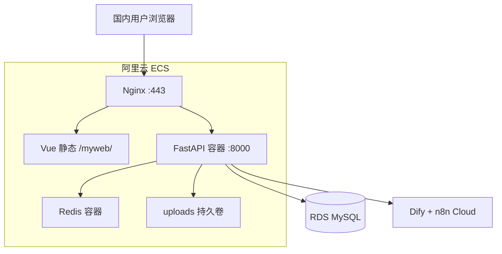

# M6 · 整站阿里云 ECS 部署（推荐方案）

> **方案**：Vue 静态站 + FastAPI + Redis + RDS，**全部同域**（`https://你的域名/myweb/` + `/api` + `/admin`）。  
> 国内访问快、运维集中、适合备案后长期运营。

---

## 一、架构



| 组件 | 开发（Windows） | 生产（M6） |
|------|-----------------|------------|
| 前端 | Vite dev | ECS Nginx 静态目录 `/var/www/cyinc/myweb/` |
| API | uvicorn | Docker `docker-compose.prod.yml` |
| MySQL | phpStudy | **RDS**（推荐） |
| Redis | 可选 | Docker 同 compose |
| 头像 uploads | `backend/uploads/` | Docker volume 持久化 |
| AI / n8n | Cloud | 不变 |

---

## 二、购买清单（首次）

| 资源 | 建议 | 说明 |
|------|------|------|
| **ECS** | 2 vCPU / 2～4 GiB，Ubuntu 22.04，40 GiB | 跑 Nginx + Docker |
| **RDS MySQL** | 1核1G 起，utf8mb4 | 与 ECS 同地域、同 VPC 更佳 |
| **域名** | `.com` / `.cn` | 解析 A 记录到 ECS 公网 IP |
| **备案** | 国内地域 **必须** | 阿里云备案控制台，约 1～2 周 |

安全组入站：**22、80、443**；不要对公网开放 8000、3306、6379。

---

## 三、第一天：ECS 初始化

### 3.1 SSH 登录后克隆仓库

```bash
sudo mkdir -p /var/www/cyinc
sudo chown $USER:$USER /var/www/cyinc
git clone https://github.com/YOUR_USER/gerenboke.git /var/www/cyinc
cd /var/www/cyinc
```

### 3.2 一键装 Docker / Nginx / Certbot

```bash
sudo bash deploy/scripts/setup-server.sh
```

### 3.3 配置 RDS

1. 控制台创建 RDS MySQL，库名 `cyinc`，用户 `cyinc`
2. 白名单加入 ECS 内网 IP
3. 复制连接串到 `backend/.env`：

```bash
cp backend/.env.production.example backend/.env
nano backend/.env
```

**整站同域 `.env` 关键项：**

```env
DATABASE_URL=mysql+pymysql://cyinc:密码@rm-xxxxx.mysql.rds.aliyuncs.com:3306/cyinc
SECRET_KEY=用 openssl rand -hex 32 生成
CORS_ORIGINS=https://你的域名.com
PUBLIC_SITE_URL=https://你的域名.com/myweb
REDIS_URL=redis://redis:6379/0
UPLOAD_DIR=uploads
```

生成 Admin 密码：

```bash
python3 -m venv backend/.venv
backend/.venv/bin/pip install -r backend/requirements.txt
backend/.venv/bin/python backend/scripts/set_admin_password.py "YourAdminPass123"
# 用户名在 .env 里 ADMIN_USERNAME=Cyinc
```

### 3.4 启动 API + Redis

```bash
docker compose -f docker-compose.prod.yml up -d --build
curl -s http://127.0.0.1:8000/api/health
```

### 3.5 Nginx + 前端目录

```bash
sudo mkdir -p /var/www/cyinc/myweb
sudo cp deploy/nginx.conf.example /etc/nginx/sites-available/cyinc
sudo nano /etc/nginx/sites-available/cyinc   # 改 server_name 为你的域名
sudo ln -sf /etc/nginx/sites-available/cyinc /etc/nginx/sites-enabled/cyinc
sudo rm -f /etc/nginx/sites-enabled/default
sudo nginx -t && sudo systemctl reload nginx
```

### 3.6 首次发布前端（本机 Windows 示例）

在项目根目录（`.env.production` 或环境变量 `VITE_API_BASE_URL=/api/v1`）：

```powershell
npm ci
npm run build
# 将 docs/ 同步到 ECS（替换 user 与 IP）
scp -r docs/* deploy@你的ECS_IP:/var/www/cyinc/myweb/
```

或使用仓库脚本（需本机有 rsync + SSH）：

```bash
bash deploy/scripts/sync-frontend.sh deploy@你的ECS_IP
```

### 3.7 HTTPS（备案通过后）

```bash
sudo certbot --nginx -d 你的域名.com -d www.你的域名.com
```

验证：

- `https://你的域名.com/myweb/` — 首页
- `https://你的域名.com/myweb/app` — 主站 Hub
- `https://你的域名.com/api/health`
- `https://你的域名.com/admin` — SQLAdmin（用户 / 论坛 / API 文章）
- `https://你的域名.com/myweb/admin` — **笔记管理台**（Markdown → Content + posts.json）

---

## 3.8 线上笔记管理台

与 SQLAdmin（`/admin`）不同：笔记管理台入口是 **`/myweb/admin`**，登录用同一套 `ADMIN_USERNAME` / `ADMIN_PASSWORD_HASH`。

发布后写入：

| 路径 | 用途 |
|------|------|
| `笔记/`（容器内 `/data/notes`） | Markdown 源 |
| `myweb/Content/*.html` | 正文 |
| `myweb/data/posts.json` | 文章目录（前端运行时拉取，无需立刻 rebuild） |

首次上线请确保：

```bash
sudo mkdir -p /var/www/cyinc/笔记 /var/www/cyinc/myweb/Content /var/www/cyinc/myweb/data
# 若前端包已含 data/posts.json，rsync 后会有；否则从本机构建产物拷贝
# 建议把本地 笔记/ 同步一份到服务器作为初始稿库
```

`.env` 生产配置（与 `docker-compose.prod.yml` 挂载一致）：

```env
NOTES_ROOT=/data/notes
SITE_WEB_ROOT=/data/web
```

验收：未登录不能读写；登录后新建 → 保存 →「发布到博客」→ 打开 `/myweb/` 可见新文。

---

## 四、从 phpStudy 迁移数据（可选）

本地导出：

```powershell
D:\phpstudy\phpstudy_pro\Extensions\MySQL5.7.26\bin\mysqldump.exe -uCyinc -p cyinclog > cyinc_backup.sql
```

上传到 ECS 后导入 RDS（在 ECS 上装 mysql-client 或用 DMS）：

```bash
mysql -h rm-xxxxx.mysql.rds.aliyuncs.com -u cyinc -p cyinc < cyinc_backup.sql
```

全新上线可跳过，API 首次启动会自动建表。

---

## 五、日常发布

### 5.1 改后端 → 服务器拉代码重建容器

```bash
ssh deploy@你的ECS_IP
cd /var/www/cyinc
bash deploy/scripts/deploy.sh
```

### 5.2 改前端 → 本机构建 + 同步

```powershell
npm run build
bash deploy/scripts/sync-frontend.sh deploy@你的ECS_IP
```

### 5.3 GitHub Actions 全自动（推荐）

配置 Secrets：`ECS_HOST`、`ECS_USER`、`ECS_SSH_KEY`  
可选 Variables：`VITE_MUSIC_BASE_URL`、`VITE_TWIKOO_ENV_ID`

推送到 `main` 后 [`.github/workflows/deploy-ecs.yml`](../.github/workflows/deploy-ecs.yml) 会：

1. `npm run build`（`VITE_API_BASE_URL=/api/v1` 同域相对路径）
2. rsync `docs/` → ECS `/var/www/cyinc/myweb/`
3. SSH 执行 `deploy/scripts/deploy.sh` 重建 API

---

## 六、运维命令

```bash
# ECS 无 docker compose 插件时用 docker-compose（带连字符）
COMPOSE="docker-compose -f docker-compose.prod.yml"
# 或：COMPOSE="docker compose -f docker-compose.prod.yml"

# API 日志
$COMPOSE logs -f api

# 重启 API
$COMPOSE restart api

# 健康检查
curl -s http://127.0.0.1:8000/api/health

# 磁盘：头像在 Docker volume uploads_data
docker volume inspect cyinc_uploads_data

# RDS 备份：阿里云控制台自动备份
```

### 6.1 常见故障

| 现象 | 原因 | 处理 |
|------|------|------|
| 全站 `/api/*` 502 | API 容器未运行或启动失败 | `docker-compose -f docker-compose.prod.yml ps` + `logs api` |
| `Can't connect to MySQL ... rm-xxxxx` | `backend/.env` 仍为示例占位符 | 改为 RDS 控制台**内网地址** |
| `UnicodeEncodeError: latin-1` | `DATABASE_URL` 密码含中文 | 密码改为纯 ASCII |
| Actions 健康检查失败 | 同上或部署先 down 后 API 起不来 | ECS 手动修 `.env` 后 `up -d --build`；见 [ECS-STATUS.md](./ECS-STATUS.md) |
| `$'\r': command not found` | shell 脚本 CRLF | 仓库已加 `.gitattributes`；ECS 上 `sed -i 's/\r$//' deploy/scripts/deploy.sh` |
| 追番页请求超时 | 旧版实时 mgnacg 搜索 ~40s | 拉最新 `main`（已关 live_suggest + 6h 缓存） |

**恢复最小步骤**（API 502 时）：

```bash
cd /var/www/cyinc
grep DATABASE_URL backend/.env   # 确认非 rm-xxxxx
docker-compose -f docker-compose.prod.yml up -d --build
curl -s http://127.0.0.1:8000/api/health
```

---

## 七、上线检查清单

- [ ] 备案完成，HTTPS 有效
- [ ] RDS 可连，表已创建或已导入
- [ ] `SECRET_KEY` 非默认值
- [ ] `/myweb/` 首页可开
- [ ] 注册 → 登录 → 发文 → 论坛 → 留言板
- [ ] 头像上传后刷新仍可见（uploads volume）
- [ ] `/admin` 可登录管理用户/文章/论坛
- [ ] Dify / n8n 生产 Key 已填

本地冒烟（Windows）：

```powershell
cd backend
.\scripts\smoke-test.ps1
.\scripts\smoke-test-posts.ps1
.\scripts\smoke-test-forum.ps1
.\scripts\smoke-test-qa.ps1
```

---

## 八、附录：与 GitHub Pages 方案对比

| | 整站 ECS（本文） | GitHub Pages + ECS API |
|--|------------------|------------------------|
| 国内速度 | 快 | Pages 可能慢 |
| 域名 | 一个 | 常 split |
| 维护 | 一台服务器 | 两套发布 |
| 适用 | **正式运营 / 简历** | 快速试 API |

若仅试验 API，可暂时保留 [deploy.yml](../.github/workflows/deploy.yml) 发 Pages；正式对外建议关闭 Pages 或只做跳转。

---

相关：[backend/README.md](../backend/README.md) · [README-cloud-dev.md](./README-cloud-dev.md) · [DEPLOY-PLAN.md](./DEPLOY-PLAN.md) · [nginx.conf.example](./nginx.conf.example)
