# CYINC 全栈实践笔记：FastAPI + Vue + Dify + N8N

> 写于 2026-07-07 · 与 Cursor AI 协作完成  
> 分支：`feat/platform-v2-fastapi`  
> 目标：把静态博客 CYINC.LOG 升级成 **AI 增强型求职向全栈平台**

---

## 一、这篇笔记是什么？

这是一份 **我们实际做完的东西** 的复盘，不是空讲概念。

你要找的是：

- 用了哪些技术、各自干什么
- 本地怎么跑起来
- Dify / n8n 怎么配、踩了哪些坑
- 怎么自测、怎么写进简历

**当前进度（2026-07-07）：**

| 里程碑 | 内容 | 状态 |
|--------|------|------|
| M1 | FastAPI 注册 / 登录 / JWT / SQLAdmin | ✅ 完成 |
| M2 | 文章 CRUD + Redis 缓存（可选） | ✅ 完成 |
| M3 | Dify 文章摘要 + 站内 AI 聊天 | ✅ 完成 |
| M4 | n8n 发文 Webhook 自动化 | ✅ 完成 |
| M5 | Hub + 个人中心 + 番茄钟 + 论坛占位 | ✅ 完成 |
| M6 | 阿里云 ECS + Docker 上线 | ⬜ 待做 |

> 📷 本文配图来自我们实际配置过程中的截图，存放在 [`images/`](./images/) 目录。

---

## 二、为什么要做这套方案？

### 2.1 起点

- **原来**：CYINC.LOG 是 Vue 3 静态博客，文章在 `Content/` 和 `posts.js` 里，部署 GitHub Pages。
- **目标**：对齐「Python + Vue + MySQL + Dify + N8N + Docker + 云部署」类岗位 JD。
- **做法**：保留现有 Vue 前端，新增 **FastAPI 后端**，用 **Dify** 做 AI，用 **n8n** 做自动化。

### 2.2 为什么叫「方案 A」？

本机 Windows 10（18363）+ MBR 磁盘，**装不了 Docker Desktop**。

所以采用：

| 跑在本机 | 跑在云端 |
|----------|----------|
| phpstudy MySQL | — |
| FastAPI | — |
| Vue 前端 | — |
| — | **Dify Cloud**（AI） |
| — | **n8n Cloud**（自动化） |

Docker 和自建 Dify/n8n **留到 M6 阿里云 ECS** 再学。

详细运维文档：[deploy/README-cloud-dev.md](../../deploy/README-cloud-dev.md)

---

## 三、整体架构（通俗版）

可以把系统想成 **前台 + 后台 + 两个云端助手**：

```
浏览器
  │
  ├─► Vue 3 前端（/myweb/）     … 页面、AI 聊天 UI
  │
  └─► FastAPI 后端（:8000）     … 业务逻辑、鉴权、统一调外部 API
         │
         ├─► MySQL（phpstudy）   … 用户、文章等持久化数据
         ├─► Redis（可选）        … 文章列表缓存，没配也能跑
         ├─► Dify Cloud         … 摘要 Workflow + 聊天 Chatflow
         └─► n8n Cloud          … 文章发布后的 Webhook 通知
```

### 3.1 各组件分工（一句话）

| 组件 | 干什么 | 不干什么 |
|------|--------|----------|
| **Vue** | 展示页面、登录、调后端 API | 不直连 Dify Key |
| **FastAPI** | 注册登录、文章 CRUD、封装 Dify/n8n | 不托管 LLM |
| **MySQL** | 存用户、文章、摘要字段 | 不做 AI 推理 |
| **Dify** | LLM 工作流：摘要、对话 | 不管发文通知 |
| **n8n** | 收到「文章已发布」→ 邮件/日志等 | 不做 AI |

### 3.2 架构图

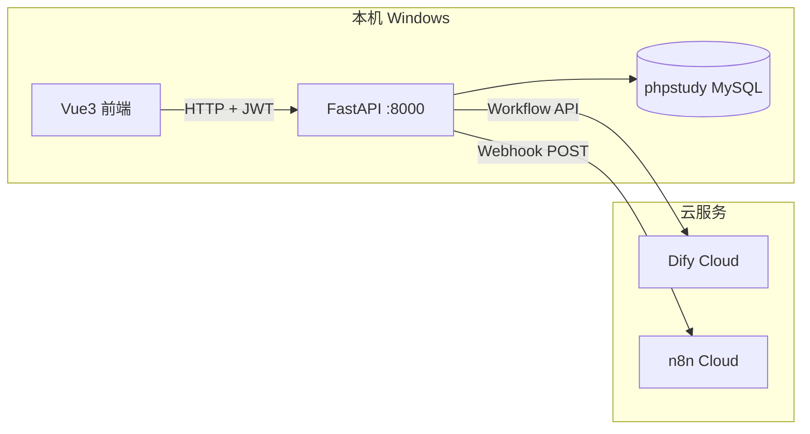

### 3.3 安全原则

- **Dify API Key、n8n URL 只写在 `backend/.env`**，不进 Git、不进前端。
- 前端通过 FastAPI 的 `/api/v1/ai/*` 间接用 AI。
- LLM 模型 Key 只配置在 **Dify 控制台**里。

---

## 四、技术栈清单

| 层级 | 技术 | 说明 |
|------|------|------|
| 前端 | Vue 3 + Vite + Pinia | 原有博客 + 新增 `/ai` 页 |
| 后端 | FastAPI + Uvicorn + SQLAlchemy | REST API + Swagger |
| 数据库 | MySQL 5.7（phpstudy） | 库名 `cyinclog` |
| 鉴权 | JWT（Bearer Token） | 登录后前端/localStorage 存 token |
| 后台 | SQLAdmin | `/admin` 管理用户等 |
| AI | Dify Cloud | Workflow + Chatflow |
| 自动化 | n8n Cloud | Webhook 触发 |
| 缓存 | Redis（可选） | 未配则自动降级直连 MySQL |
| 开发协作 | Cursor | 结对写代码、排错、文档 |

---

## 五、仓库结构（和全栈相关的部分）

```
gerenboke/
├── backend/                    # FastAPI 后端
│   ├── app/
│   │   ├── api/v1/             # auth · posts · ai · integrations
│   │   ├── services/
│   │   │   ├── dify_client.py  # 调 Dify
│   │   │   ├── n8n_client.py   # 调 n8n Webhook
│   │   │   └── cache.py        # Redis 缓存
│   │   ├── models/             # User · Post
│   │   ├── admin/              # SQLAdmin
│   │   └── main.py
│   ├── .env                    # 本地配置（勿提交）
│   └── scripts/                # 建库、冒烟测试脚本
├── src/
│   ├── views/AiChat.vue        # 站内 AI 助手页
│   └── api/platform.js         # 调 FastAPI
├── deploy/
│   ├── README-cloud-dev.md     # 方案 A 指南
│   └── README-dify.md          # Dify 详细说明
└── 笔记/项目/
    ├── images/                  # 本文配图（Dify / n8n / Swagger 截图）
    ├── CYINC动态主站工作流.md   # 总体规划
    └── CYINC全栈实践-...md      # 本文
```

---

## 六、本地环境怎么跑？

### 6.1 前置条件

1. **phpstudy** 里 MySQL 已启动
2. Python 3.10+，`backend/.venv` 已 `pip install -r requirements.txt`
3. Node.js，`npm install` 过

### 6.2 启动顺序

**终端 1 — 后端：**

```powershell
cd d:\phpstudy\phpstudy_pro\WWW\gerenboke\backend
.\.venv\Scripts\python.exe -m uvicorn app.main:app --host 127.0.0.1 --port 8000
```

看到 `Application startup complete` 且无 MySQL 报错即成功。

**终端 2 — 前端：**

```powershell
cd d:\phpstudy\phpstudy_pro\WWW\gerenboke
npm run dev
```

### 6.3 常用地址

| 用途 | 地址 |
|------|------|
| Swagger API 文档 | http://127.0.0.1:8000/api/docs |
| 健康检查 | http://127.0.0.1:8000/api/health |
| 集成状态 | http://127.0.0.1:8000/api/v1/integrations/status |
| SQLAdmin | http://127.0.0.1:8000/admin |
| 前端 AI 页 | http://localhost:5173/myweb/ai |
| 静态博客 | http://localhost:5173/myweb/ |

> **注意**：Swagger 在 `/api/docs`，不是 `/docs`（后者会重定向）。  
> JSON 接口用 Chrome 打开；Cursor 内置浏览器可能显示白屏，但接口正常。

### 6.4 改 `.env` 后必须重启 FastAPI

`DIFY_*`、`N8N_*` 等变量是启动时读的，改完保存后要 `Ctrl+C` 再启动 uvicorn。

### 6.5 端口 8000 被占用

```powershell
netstat -ano | findstr ":8000"
taskkill /PID <PID> /F
```

---

## 七、`backend/.env` 配置说明

```env
# 数据库（phpstudy MySQL）
DATABASE_URL=mysql+pymysql://用户名:密码@127.0.0.1:3306/cyinclog

# JWT
SECRET_KEY=随机长字符串
ACCESS_TOKEN_EXPIRE_MINUTES=10080

# 跨域（前端 dev 地址）
CORS_ORIGINS=http://localhost:5173,http://127.0.0.1:5173

# SQLAdmin
ADMIN_USERNAME=admin
ADMIN_PASSWORD_HASH=bcrypt哈希

# Redis（方案 A 可留空）
REDIS_URL=

# Dify Cloud
DIFY_API_URL=https://api.dify.ai/v1
DIFY_SUMMARY_API_KEY=app-摘要Workflow的Key
DIFY_CHAT_API_KEY=app-聊天Chatflow的Key
DIFY_TIMEOUT_SEC=60

# n8n Cloud
N8N_WEBHOOK_URL=https://你的实例.app.n8n.cloud/webhook/cyinc-post
N8N_WEBHOOK_SECRET=可选
PUBLIC_SITE_URL=http://127.0.0.1:5173/myweb
```

**集成状态检查：**

```text
GET /api/v1/integrations/status
```

期望：`summary_ready: true`、`chat_ready: true`、`webhook_ready: true`。

---

## 八、M1：用户与后台（我们做了什么）

### 8.1 功能

- `POST /api/v1/auth/register` — 注册
- `POST /api/v1/auth/login` — 登录，返回 `access_token`
- `GET /api/v1/auth/me` — 当前用户（需 Bearer Token）
- SQLAdmin `/admin` — 浏览器里管理用户表

### 8.2 踩坑：bcrypt 与 passlib

早期注册 500，原因是 passlib 与新版 bcrypt 不兼容。  
**解决**：`security.py` 改为直接使用 `bcrypt` 库哈希密码。

### 8.3 Swagger 怎么用 Token？

1. `POST /auth/login` 拿 `access_token`
2. 右上角 **Authorize** → 填 `Bearer <token>`
3. 之后带锁的接口会自动带授权头

---

## 九、M2：文章 CRUD

### 9.1 主要接口

| 方法 | 路径 | 说明 |
|------|------|------|
| GET | `/api/v1/posts` | 公开列表（默认已发布） |
| GET | `/api/v1/posts/mine` | 我的文章（含草稿） |
| GET | `/api/v1/posts/{id}` | 详情 |
| POST | `/api/v1/posts` | 创建 |
| PATCH | `/api/v1/posts/{id}` | 更新 |
| DELETE | `/api/v1/posts/{id}` | 删除 |
| POST | `/api/v1/posts/{id}/summary` | Dify 生成/刷新摘要 |

### 9.2 创建文章示例

```json
{
  "title": "文章标题",
  "content": "正文内容",
  "category": "技术",
  "tags": ["Vue", "FastAPI"],
  "status": "published"
}
```

`status` 只能是 `draft` 或 `published`。  
**只有变成 `published` 时才会触发 n8n Webhook。**

### 9.3 Redis

配置了 `REDIS_URL` 会缓存文章列表；没配置则自动跳过，不影响功能。

---

## 十、M3：Dify 集成（重点）

Dify 分两个应用，**两个 Key，不要混用**。

### 10.1 应用 1：文章摘要 Workflow

**在 Dify 里：**

1. 创建应用 → **工作流（Workflow）**
2. **开始** 节点添加输入变量（我们踩坑找很久）：
   - `title` — 文本
   - `content` — 段落（或文本）

   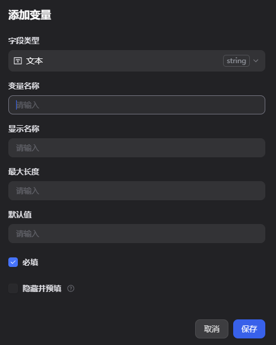

3. **LLM** 节点（如 DeepSeek），Prompt 示例：

   ```
   请为以下博客写 100 字以内中文摘要。
   标题：{{#title#}}
   正文：{{#content#}}
   ```

4. **输出** 节点：变量名 `summary`，值选 **LLM → text**

   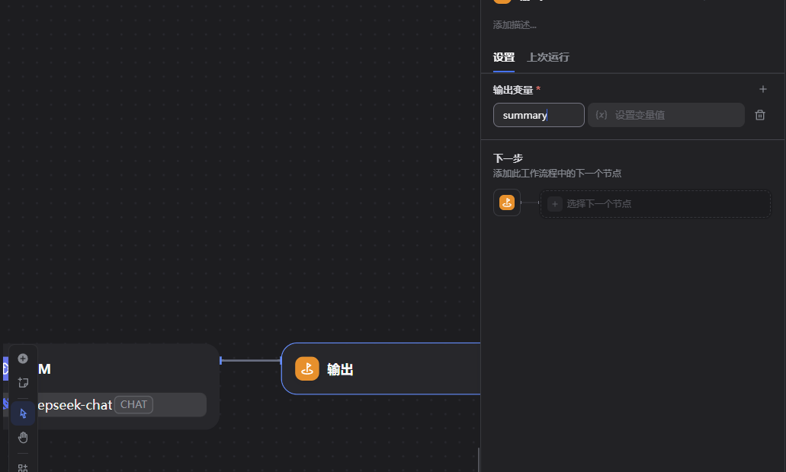

5. **发布** → API 访问 → 复制 Key → `DIFY_SUMMARY_API_KEY`

   测试运行成功示例（右上角「运行」）：

   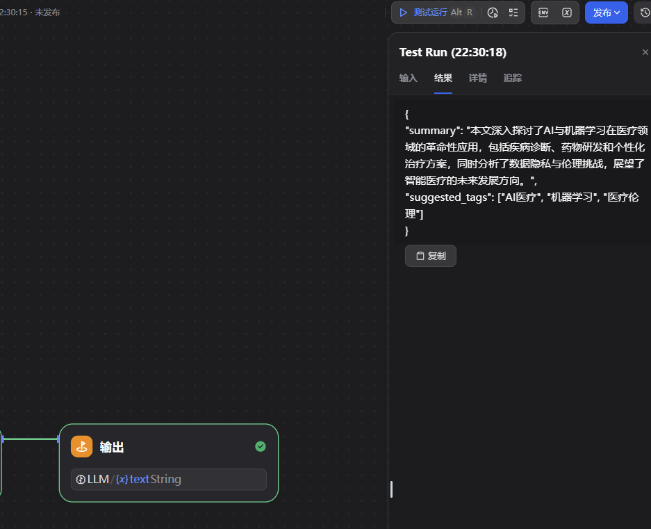

   API 文档页：Base URL + Bearer Key 填到 `.env`：

   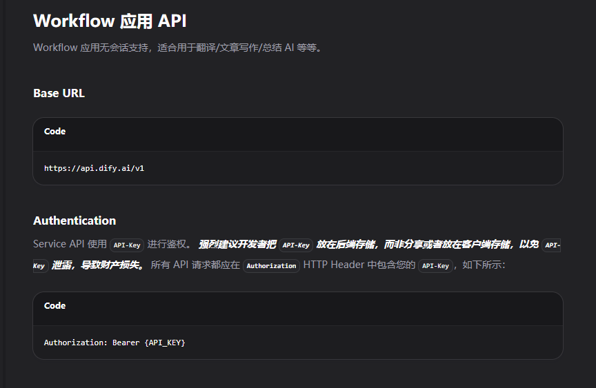

**FastAPI 怎么调：**

- 接口：`POST https://api.dify.ai/v1/workflows/run`
- 代码：`backend/app/services/dify_client.py` → `run_summary_workflow()`
- 传入：`inputs: { "title": "...", "content": "..." }`

**后端入口：**

- `POST /api/v1/ai/summary` — 直接传 title/content
- `POST /api/v1/posts/{id}/summary` — 对已有文章生成摘要并写入 `ai_summary` 字段

### 10.2 应用 2：站内助手 Chatflow

**在 Dify 里：**

1. 创建应用 → **Chatflow**（不是 Workflow）

   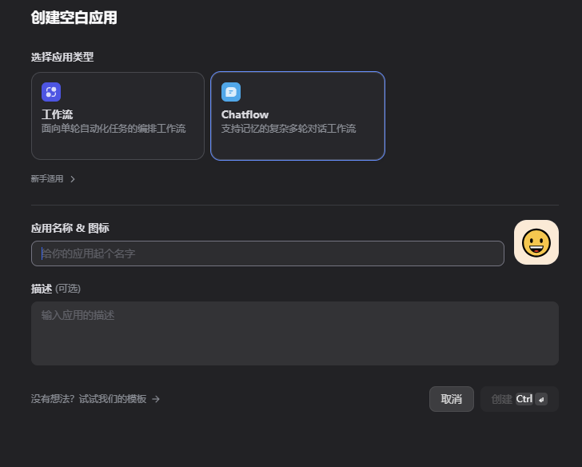

2. 默认已有 `userInput.query`，**不用再加自定义字段**

   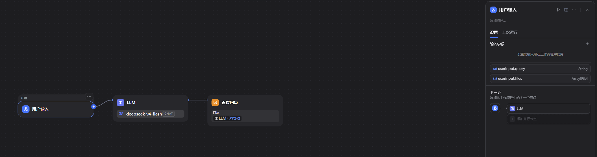

3. 流程：**用户输入 → LLM → 直接回答**（`{{LLM.text}}`）
4. 可选：建知识库，上传博客 Markdown，做 RAG
5. 发布 → 复制 Key → `DIFY_CHAT_API_KEY`

**FastAPI 怎么调：**

- 接口：`POST https://api.dify.ai/v1/chat-messages`
- 代码：`run_chat()`，传 `query` 和可选 `conversation_id`

**前端：**

- 页面：`/myweb/ai`（`src/views/AiChat.vue`）
- 需先登录平台账号，再发消息

### 10.3 Dify 踩坑汇总

| 问题 | 原因 | 解决 |
|------|------|------|
| 找不到「开始」输入变量 | 要在点开始节点后右侧/节点底部找「添加变量」，不是左侧「添加节点」 | 变量名必须 `title`、`content` |
| Swagger 聊天 400 | body 里 `conversation_id: "string"` 是占位符 | 删掉该字段或留 null；后端已自动忽略 `"string"` |
| `DIFY_API_URL` 双 `/v1` | 代码会拼 `/v1/workflows/run` | `.env` 写 `https://api.dify.ai/v1` 或 `https://api.dify.ai` 均可（已兼容） |
| 摘要里是整段 JSON 字符串 | LLM 输出 JSON，输出节点只映射了 text | 可改 Prompt 只输出纯文本，或后续让后端解析 JSON |
| DeepSeek 回答带 `` | 模型思考标签 | 后端 `_extract_answer()` 会 strip |

**Swagger 聊天 400 示例**（`conversation_id` 误填 `"string"`）：

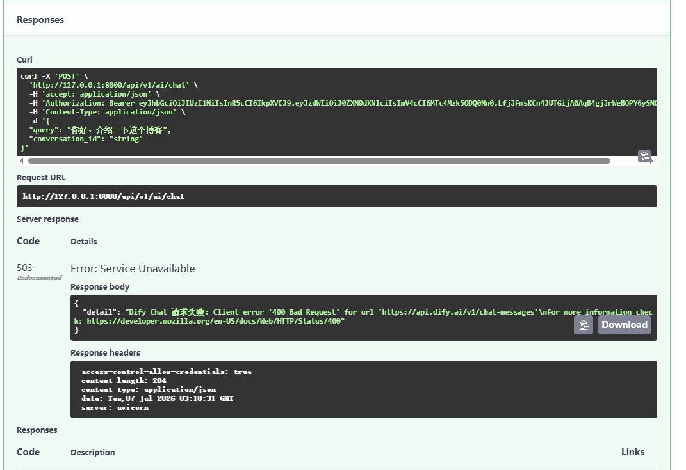

**Swagger 聊天 503 示例**（换用户后未更新 Token，或 Dify 偶发超时）：

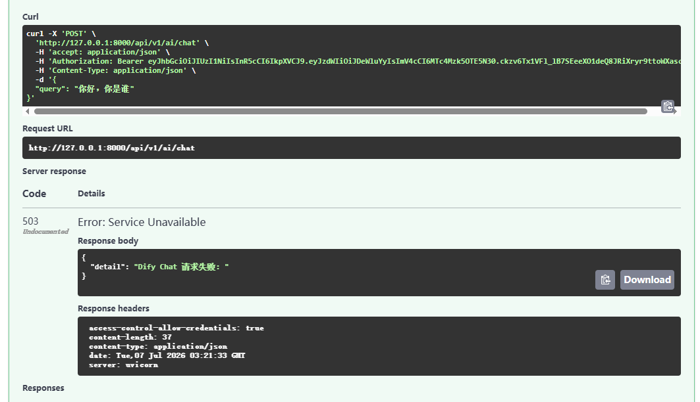

### 10.4 模型配置

在 Dify → **模型供应商** 里安装 DeepSeek / 通义等，并在 LLM 节点里选模型。  
**LLM Key 只放 Dify，不放本项目 Git。**
（这个冲了两块钱！）

---

## 十一、M4：n8n 集成（重点）

### 11.1 n8n 是干什么的？

**文章发布** 时，FastAPI 后台 POST 一条 JSON 到 n8n 的 Webhook URL。  
n8n 收到后可以：发邮件、写表格、推飞书、仅记录日志……  
**改自动化逻辑不用改 FastAPI**，在 n8n 画布上拖节点即可。

### 11.2 在 n8n Cloud 里怎么建？

1. 注册 [n8n.io](https://n8n.io)（个人可用 Gmail，「Company email」只是文案）
2. 新建 Workflow
3. 触发器：**On webhook call**
   - Method: **POST**
   - Path: `cyinc-post`（自定）

   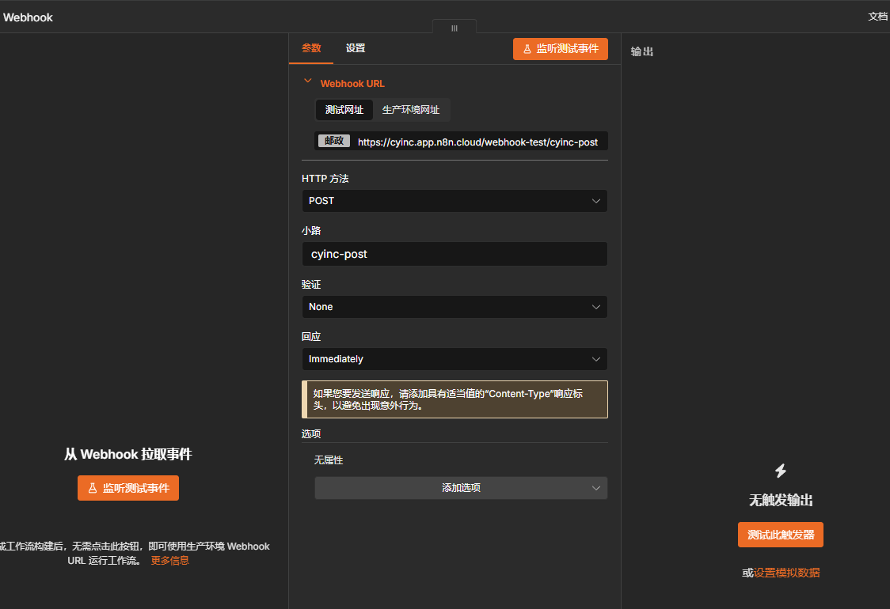

4. 后续节点：**No Operation**（演示够用）
5. **Publish**（新版 n8n 用 Publish 代替旧的 Active 开关）

   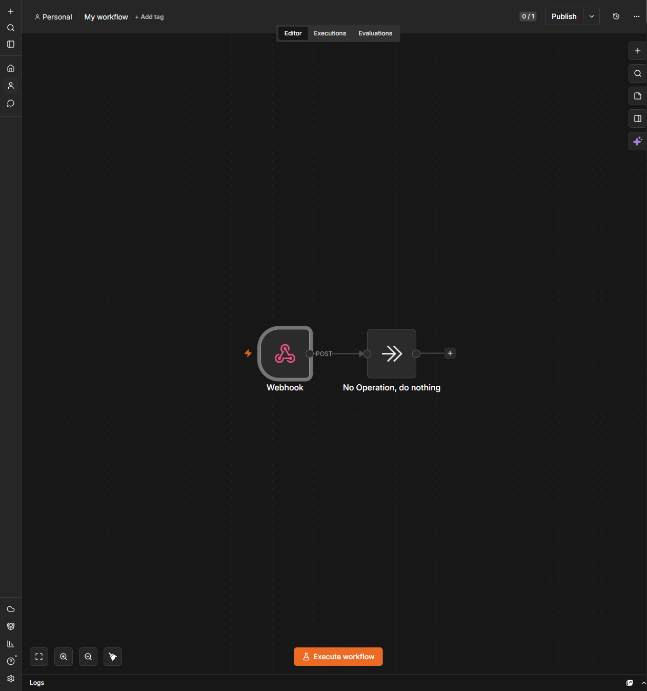

   发布时弹出的 Production Checklist **可忽略**：

   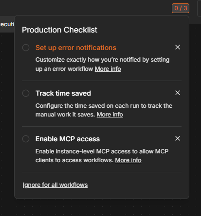

6. 复制 **Production URL**（不是 Test URL）：

   ```text
   https://cyinc.app.n8n.cloud/webhook/cyinc-post
   ```

7. 写入 `N8N_WEBHOOK_URL`，重启 FastAPI

### 11.3 Webhook 载荷（FastAPI 发什么）

```json
{
  "event": "post.published",
  "post_id": 1,
  "title": "n8n 测试文章",
  "slug": "n8n-测试文章",
  "category": "测试",
  "tags": ["n8n"],
  "url": "http://127.0.0.1:5173/myweb/content/1",
  "author": "Cyinc",
  "author_nickname": "昵称",
  "published_at": "2026-07-07T12:00:00"
}
```

代码位置：`backend/app/services/n8n_client.py`

### 11.4 什么时候触发？

- `POST /posts` 且 `status: "published"`
- `PATCH /posts/{id}` 从 `draft` 改为 `published`

失败 **只打日志，不阻塞发文**（自动化不应拖垮主流程）。

### 11.5 n8n 踩坑汇总

| 问题 | 原因 | 解决 |
|------|------|------|
| 找不到 Active 开关 | n8n 2.x 改成 **Publish** | 点右上角 Publish |
| Production Checklist 弹窗 | 生产环境建议项 | 点 Ignore，不必配 |
| Executions 没记录 | 未 Publish 或用了 Test URL | 用 Production URL + Publish |
| 只有 14 天试用 | Cloud 无永久免费 | 试用期内完成 M4 + 导出 JSON；M6 ECS 自托管 Community 版 |

---

## 十二、完整自测清单（我们就是这样验的）

### 12.1 基础

- [ ] MySQL 启动，FastAPI 无报错
- [ ] `GET /api/health` 返回 `{"code":0,...}`
- [ ] `GET /api/v1/integrations/status` 三项 ready 为 true

### 12.2 鉴权

- [ ] Swagger 注册 + 登录 + Authorize
- [ ] `GET /auth/me` 返回当前用户

### 12.3 文章 + Dify 摘要

- [ ] `POST /posts` 创建文章
- [ ] `POST /posts/{id}/summary` 或 `POST /ai/summary` 有摘要返回

### 12.4 AI 聊天

- [ ] `POST /ai/chat`，body 只有 `query`（不要 `conversation_id: "string"`）
- [ ] 前端 `/myweb/ai` 登录后能对话

### 12.5 n8n

- [ ] Swagger `POST /posts`，`status: "published"`
- [ ] n8n **Executions** 出现成功记录，Webhook 节点有 JSON

---

## 十三、数据流串讲（一次发布文章会发生什么）

1. 用户在 Swagger 或未来前端提交文章，`status: published`
2. FastAPI 写入 MySQL `posts` 表
3. 后台线程调用 `notify_post_published()` → POST 到 n8n Webhook
4. n8n Executions 记录一次运行
5. （可选）用户点「生成摘要」→ FastAPI 调 Dify Workflow → 结果写入 `ai_summary`
6. （独立）用户在 `/ai` 页聊天 → FastAPI 调 Dify Chatflow → 返回 `answer`

---

## 十四、和静态博客的关系

| | 静态博客（main 分支习惯） | 平台 v2（本分支） |
|--|---------------------------|-------------------|
| 文章存储 | `Content/` + `posts.js` | MySQL `posts` 表 |
| 部署 | GitHub Pages | 未来 ECS + Nginx |
| AI / 自动化 | 无 | Dify + n8n |

两条线可以并存：静态站继续展示历史文章，平台 v2 做动态能力和求职演示。

---

## 十五、面试 / 简历怎么讲

### 15.1 一句话

> 在 CYINC.LOG 基础上，用 Cursor 协作完成 Vue 3 + FastAPI + MySQL 全栈平台；集成 Dify Cloud 实现文章摘要与站内 AI 问答；n8n Cloud Webhook 实现发文自动化；本地 phpstudy 开发，生产计划部署阿里云 ECS + Docker。

### 15.2 可展开的技术点

- **后端**：JWT 鉴权、SQLAlchemy ORM、统一 `ApiResponse`、SQLAdmin、Swagger
- **AI**：Dify Workflow / Chatflow 双应用，Key 隔离，后端封装 `dify_client`
- **自动化**：发文事件驱动 n8n，失败降级不阻塞主流程
- **工程化**：`.env` Secrets 管理、集成状态接口、方案 A 绕过本机 Docker 限制

### 15.3 诚实说明

- n8n Cloud 为 **14 天试用**，工作流已导出备份，生产拟 **ECS 自托管**
- Redis / Docker 在 M6 上线阶段补齐

---

## 十六、常见问题 FAQ

**Q：Swagger 白屏？**  
A：用 Chrome；JSON 接口地址不要复制带中文说明；Swagger 正确地址是 `/api/docs`。
注意：cursor自带的浏览器会白屏，要用电脑的浏览器比如Chrome！！！

**Q：chat_ready true 但聊天 503？**  
A：换用户后要在 Swagger **重新 Authorize**；检查 Dify Chatflow 是否 Publish；看 `detail` 具体错误。

**Q：n8n 收不到？**  
A：必须 `published`；必须 Publish 工作流；`.env` 用 Production URL；重启 FastAPI。

**Q：Dify 摘要 tags 没写入？**  
A：当前 LLM 可能输出 JSON 字符串在 `summary` 里，标签解析可后续优化。

**Q：Git 要提交 `.env` 吗？**  
A：**不要**。只提交 `.env.example`。

---

## 十七、M5 完成记录（2026-07-07）

### 新增前端页面

| 路径 | 组件 | 说明 |
|------|------|------|
| `/hub` | `Hub.vue` | 平台聚合入口 |
| `/me` | `Me.vue` | 登录、资料、我的文章 |
| `/pomo` | `Pomo.vue` | 25/5 番茄钟 + 统计 |
| `/forum` | `Forum.vue` | Coming Soon（Phase C） |

NavBar 新增 **平台** → `/hub`；登录后显示 **我的** → `/me`。

### 新增后端

- `pomodoro_sessions` 表
- `POST/GET /api/v1/pomodoro/sessions`
- `GET /api/v1/pomodoro/stats`

### 验收

1. `http://localhost:5173/myweb/hub` — 五张入口卡片
2. `/me` — 登录后可改昵称、看文章列表
3. `/pomo` — 专注完成（登录后）写入统计
4. `/forum` — 占位页
5. 博客首页 `/` 行为不变

**改代码后需重启 FastAPI**，以加载 pomodoro 路由并建表。

---

## 十八、M5.5 完成记录（2026-07-07）

### 主站与博客分离

| 区域 | 布局 | 核心路径 |
|------|------|----------|
| 博客 | `NavBar.vue` | `/`、`/archive`、`/ai` … |
| 主站 | `PlatformLayout` + `PlatformNav` | `/app`、`/app/forum`、`/app/me`、`/app/pomo` |

博客 NavBar 增加 **主站** → `/app`；主站顶栏 **返回博客** → `/`。旧路由自动重定向：`/hub`→`/app`，`/me`→`/app/me`，`/pomo`→`/app/pomo`，`/forum`→`/app/forum`。

### 论坛 MVP

**后端**：`forum_categories` / `forum_threads` / `forum_replies` 三表；启动时 seed 三板块（tech / projects / chat）。

| 方法 | 路径 | 说明 |
|------|------|------|
| GET | `/forum/categories` | 板块列表 |
| GET | `/forum/categories/{slug}/threads` | 板块帖子 |
| GET | `/forum/threads/recent` | 主站首页最新帖 |
| GET | `/forum/threads/{id}` | 详情 + 回帖 |
| POST | `/forum/threads` | 发帖（JWT） |
| POST | `/forum/threads/{id}/replies` | 回帖（JWT） |
| GET | `/forum/threads/mine` | 我的帖子 |

**前端**：`ForumCategories` / `ForumCategory` / `ForumThread` / `ForumNewThread` 四页；API 封装见 `src/api/platform.js`。

### 番茄钟 v2 + 个人中心

- `pomodoro_sessions.reflection` 字段；`POST /pomodoro/sessions` 支持 `reflection`
- `GET /pomodoro/timeline` 按日分组，供个人中心时间线 Tab
- `/app/pomo`：SVG 圆环、localStorage 时长设置、全屏、浏览器通知、专注结束反思弹窗、本周柱形图
- `/app/me`：四 Tab（资料 / 我的文章 / 我的帖子 / 专注时间线）

### 验收

1. `http://localhost:5173/myweb/` NavBar 有「主站」；`/myweb/app` 有 PlatformNav 与「返回博客」
2. `/myweb/app/forum` 可见三板块，登录后可发帖、回帖
3. `/myweb/app/me` 四 Tab 正常，时间线显示带反思的番茄记录
4. `/myweb/app/pomo` 圆环 + 设置 + 全屏 + 结束弹窗
5. 博客侧登录后主站识别同一 JWT（`cyinc_platform_token`）

**改代码后需重启 FastAPI**，以加载 forum / timeline 路由并建表。

---

## 十九、下一步（M6）

- 购买阿里云 ECS（建议 4C8G）
- Docker Compose：Nginx + FastAPI + MySQL + Redis + Dify + n8n
- HTTPS、域名、备份
- 子域名拆分（`blog.xxx` / `forum.xxx`）

---

## 二十、相关文档索引

| 文档 | 路径 |
|------|------|
| 总体规划 | [CYINC动态主站工作流.md](./CYINC动态主站工作流.md) |
| 方案 A 操作指南 | [deploy/README-cloud-dev.md](../../deploy/README-cloud-dev.md) |
| Dify 详细配置 | [deploy/README-dify.md](../../deploy/README-dify.md) |
| 后端 API | [backend/README.md](../../backend/README.md) |
| 仓库 README | [README.md](../../README.md) |

---

## 二十一、协作过程小结

这份方案不是一次写完的，而是 **分里程碑迭代** 的典型全栈协作：

1. 先定 **方案 A**（本机无 Docker），避免在 Windows 环境死磕
2. **M1/M2** 打好后端地基（能登录、能发文）
3. **M3** 云端 Dify：摘要 Workflow + 聊天 Chatflow，Key 分离
4. **M4** 云端 n8n：Publish 激活 Webhook，Swagger 发文验证 Executions
5. 每步都有 **Swagger 可测接口** 和 **integrations/status** 可观测配置

如果你以后忘了某一步怎么配，优先查：

- 集成状态 JSON
- Swagger `/api/docs`
- 本文对应章节

---

## 二十二、配图索引

| 文件名 | 说明 | 所在章节 |
|--------|------|----------|
| `dify-add-variable.png` | Workflow 开始节点添加 `title` / `content` | §10.1 |
| `dify-output-summary.png` | 输出节点映射 `summary` ← LLM.text | §10.1 |
| `dify-test-run-result.png` | Workflow 测试运行返回 JSON 摘要 | §10.1 |
| `dify-workflow-api.png` | Dify API 文档 Base URL + Bearer Key | §10.1 |
| `dify-chatflow-create.png` | 创建应用时选择 Chatflow | §10.2 |
| `dify-chatflow-nodes.png` | Chatflow 默认三节点流程 | §10.2 |
| `swagger-chat-400.png` | Swagger 聊天 400（conversation_id 占位符） | §10.3 |
| `swagger-chat-503.png` | Swagger 聊天 503（Token/超时） | §10.3 |
| `n8n-webhook-config.png` | n8n Webhook POST 配置 | §11.2 |
| `n8n-workflow-publish.png` | Webhook → No Op + Publish 按钮 | §11.2 |
| `n8n-production-checklist.png` | 发布弹窗可 Ignore | §11.2 |

所有图片路径：`笔记/项目/images/`（相对本文 `./images/`）。

---

*本文档随项目演进可继续追加 M6 完成记录与截图。*
